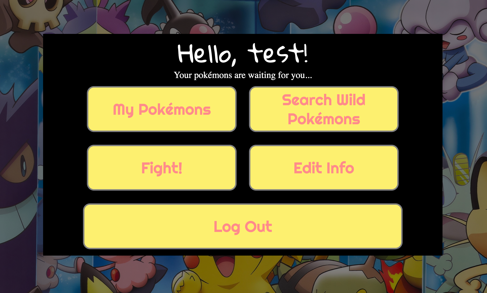
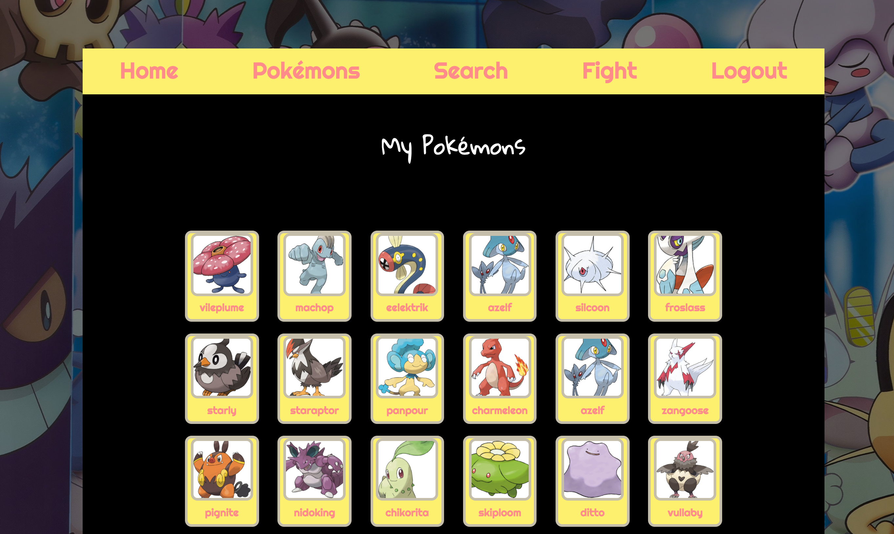

# Poké Fight

## What is Poké Fight?

> Welcome, trainer! Create your own account and challenge other trainers! You can catch wild pokémons and build your own pokémon team.

## Screenshots

## Technical Discussion

> HTML & EJS
> Javascript & jQuery
> AJAX
> CSS
> NodeJS & ExpressJS
> SQL & PG-Promise
> Authentication & API Call

### Code Snippet

> List the other trainers and their pokémons amount

    usersController.list=(req,res)=>{
    User.findOthers(req.user.id)
    .then(users=>{
        return User.pokemonCount(req.user.id)
        .then(pokemonCount=>{
            return{users:users,
                   pokemonCount:pokemonCount}
        })
    })
    .then(data=>{
        res.render('pokemons/pokemon-fight',{
            currentPage:'list',
            message:'ok',
            pokemonCount:data.pokemonCount,
            users:data.users,
        });
    })
    .catch(err=>{
        console.log(err);
        res.status(500).json(err);
    })
}

> Randomly pick cards from your team and opponent's team
    
    usersController.pick=(req,res)=>{
    User.pickRandom(req.user.id)
    .then(firstPokemon => {
        return User.pickRandom(req.params.id)
                .then(secondPokemon => {
                    return { first: firstPokemon,
                             second: secondPokemon}
                })
    })
    .then(data => {
        res.render('pokemons/pokemon-start',{
            currentPage:'start',
            message:'ok',
            params:req.params,
            data:data,
        });
    })
    .catch(err=>{
        console.log(err);
        res.status(500).json(err);
    })
}

> Randomly find the winner but let the attack/defense difference affect the chances (the higher the numbers, the better chances to win).

    $(()=>{
    $('button').click(()=>{
        console.log('get a winner');
        let attack1=$('.card1 .attack').text();
        let defense1=$('.card1 .defense').text();
        let attack2=$('.card2 .attack').text();
        let defense2=$('.card2 .defense').text();
        const compare=((attack1-defense2)+(defense1-attack2))/400;
        const rand=Math.random()*(2+compare*4)
        // this multiplication could be changed. 
        // depends on how you want the card difference 
        // to affect the result
        let lost
        if(rand>=1){
            lost=2;
        }else{
            lost=1;
        }
        $(`.card${lost}`).remove();
        $('.vs').remove();
        $('.bet').remove();
        $('button').remove();
        $('.banner').css('animation','rotate 1s linear');
        if($('.container .card1').length>0){
            $('.banner').text('You Won!');
        }else if($('.container .card2').length>0){
            $('.banner').text('Try again later!');
        }
        let $returnBtn=$("<input class='buttons againOrReturn' type='submit' value='Return' />");
        $('.return').append($returnBtn);
        let $againBtn=$("<input class='buttons againOrReturn' type='submit' value='Again!' />");
        $('.again').append($againBtn);
    })
})

## The Making of Poké Fight

> I used the Pikéapi: http://pokeapi.co/ to search for pokémons and all the card info come from this database.

> John's Ajax lecture gave me the inspiration and I used similar ways of Api calls using Ajax.

> Ramsey gave me useful advice on the logics and helped me to clearify the structure of the app.

## Opportunities for the Futrue Growth

> 1. Inventory feature: collect food on the userhome page and save to the inventory; use food to catch new pokémons and level them up; also bet on food in the pokémon fight.

> 2. New column of winning records, in order to build a 'leader board' including all users.

> 3. Animations for the homepage on load and during the fight.
