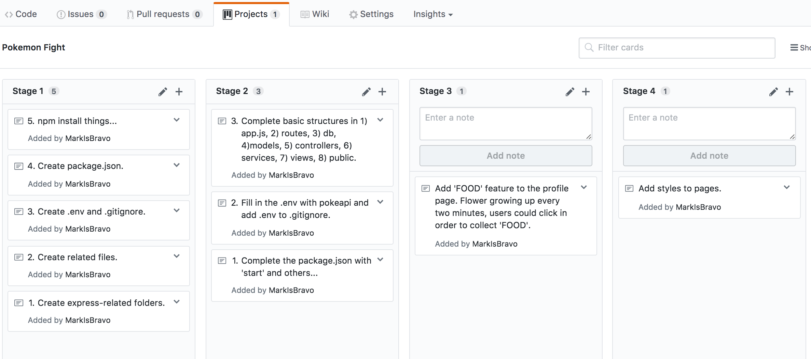

*** Mark Zheng Ma / 7/11/2017 ***

# [Poké Fight] Proposal

## What is [Poké Fight]?

A card game where you could be a real pokemon trainer! Catching wild pokemons and level them up! Also you could combat with other trainers, grabing trophies to upgrade your pokemons!

## Wireframe

## Initial thoughts on game structure

Stages:
* Login/Register;
* Profile page: with buttons 'My pokemons', 'Search new', 'Combat' and 'Collect food'(I'll leave the level up part to the last...)
* My pokemons: list of your pokemons and click to jump to detail page. Also a box with number of 'FOOD' in your inventory.
* Search new: using 'FOOD' to search for new pokemon from the external database.
* Collect food: there will be a bowl of flower growing up every 2 mins on the profile page. Click on the grown-up flower to collect 'FOOD', adding 1 to user's inventory. The flower is only collectable 2 mins after last collect event. The flower will not grow anymore after 2 mins even if not collected. Only after collected would flower start growing again.
* Combat: a list of other users, click to see their profiles and select to compete against them. After combat started, random pokemon will be picked from both sides. User will be able to see them and choose the amount of 'FOOD' they want to bet on their pokemon (minimum 1 and will be subtracted from their inventory column immediately). The higher the HP & Attack, the higher chance they have to win the combat (always less than 100%). If user wins, doubled amount of 'FOOD' will be added to inventory. If user loses, the bet amount of 'FOOD' will be added to opponent's inventory column.

Database: poke_fight
* users table: containing all user's info, user_id and inventory.
* pokemon: containing pokemons caught from the pokeapi database, including user_id(renference to users table), id, attack, hp, description, image.

## Phases of Completion

## Links and Resources

Pikéapi: http://pokeapi.co/